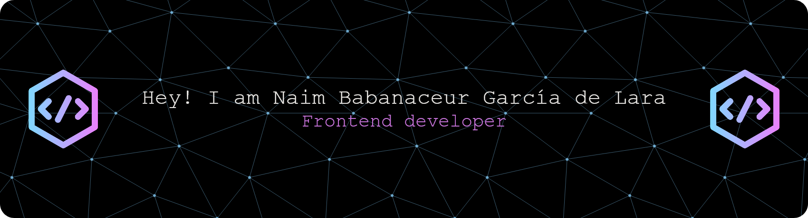

# 💫 About Me:
🔭 I’m currently working on improving my skills 🌱 I’m currently learning Angular & React. 💬 Ask me about: 💻 Frontend development basics, 🎨 TailwindCSS & UI design       🛠 Building responsive web apps, Learning paths for frontend devs... . ⚡ Fun fact: I sometimes refactor code just because it feels relaxing.

## 🌐 Socials:
   

# 💻 Tech Stack:
                                            

# 📊 GitHub Stats:

  
  

 
 

  
  ### See more in my 

 
 

  
### ✍️ Random Dev Quote

---

<!-- Proudly created with GPRM ( https://gprm.itsvg.in ) -->
